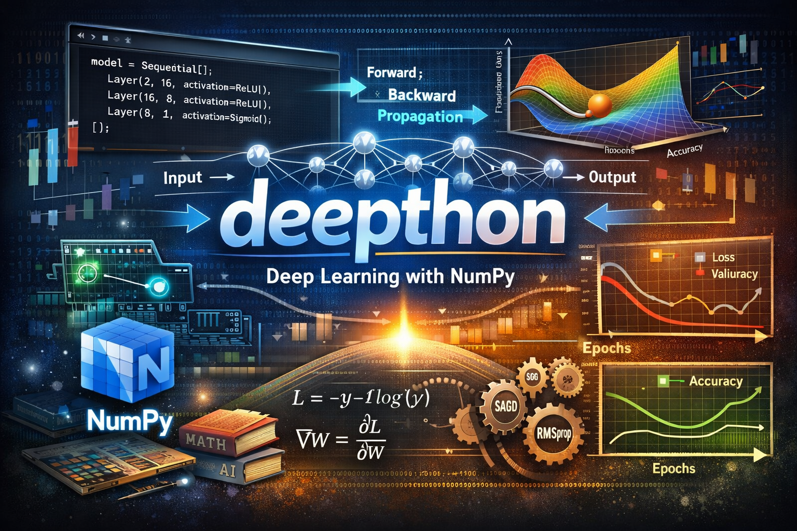

---

<div align="center">

# 🧠 **deepthon**
### *A Minimal Deep Learning Framework Built from Scratch with NumPy*

## **Research-oriented • Transparent • Mathematical • Lightweight**


[](https://numpy.org)
[](LICENSE)
[](#)
[](https://github.com/Ibraheem-Al-hafith/deepthon)



</div>

---

# 📜 Abstract

**deepthon** is a **from-scratch neural network framework** implemented using only **NumPy**.  
It is designed to serve as a **research, educational, and experimental platform** for understanding the internal mechanics of modern deep learning systems.

Unlike PyTorch or TensorFlow, **deepthon exposes the mathematics** behind:
- Forward propagation  
- Loss computation  
- Backpropagation  
- Gradient-based optimization  

> deepthon treats neural networks not as black boxes, but as **numerical systems**.

---

# 🧬 Motivation

Modern deep learning frameworks hide critical details behind automatic differentiation and optimized kernels.  
This is excellent for production—but terrible for **learning, theory, and research debugging**.

deepthon was created to answer:
> *“What actually happens when a neural network trains?”*

deepthon allows you to:
- Inspect gradients
- Modify the learning rule
- Inject custom math
- Perform controlled experiments


---

# ✨ Features

| Category | Capabilities |
|--------|--------------|
| 🧠 Models | `Sequential` API, fully modular layers |
| 🔢 Math | Manual forward & backward propagation |
| ⚡ Optimization | SGD, Adam, RMSProp, LR schedulers |
| 📉 Losses | MSE, BCE, Cross-Entropy |
| 📊 Metrics | Accuracy, Precision, Recall |
| 🧪 Experiments | Validation, metrics, training history |
| 🪶 Dependencies | NumPy only |


---


Each component is mathematically isolated and explicitly implemented.

---

# 📦 Installation
**uv installation**

* 1. Download and build the dependencies:

```bash
git clone https://github.com/Ibraheem-Al-hafith/deepthon
cd deepthon
uv sync

```

* 2. Activate the environment:
> A. for windows:

```
.venv/Scripts/activate

```
> B. for mac/linux

```
.venv/bin/activate

```

---

# 🚀 Minimal Experiment
**(note): you can check examples in [examples](/examples), see the next section**

```python
import numpy as np
from deepthon.nn import Sequential, Layer
from deepthon.nn.activations import ReLU, Sigmoid
from deepthon.nn.losses import BCE
from deepthon.nn.optimizers import Adam
from deepthon.pipeline import Trainer

X = np.random.randn(500, 2)
y = (X[:, 0] * X[:, 1] > 0).astype(float).reshape(-1, 1)

model = Sequential([
    Layer(2, 16, activation=ReLU()),
    Layer(16, 8, activation=ReLU()),
    Layer(8, 1, activation=Sigmoid())
])

trainer = Trainer(
    model=model,
    optimizer=Adam(lr=1e-3),
    loss_func=BCE(),
    batch_size=32,
    metric_fn="accuracy"
)

trainer.train(X, y, epochs=30)
```

# run examples :

### run simple `sklearn` circles dataset experiment:

```
uv run examples/circles_classification.py

```

---


Tracks:

* Loss
* Accuracy
* Validation metrics
* Learning rate

---

# 🗂 Codebase

```
deepthon/
│
├── nn/           # layers, activations, losses, optimizers
├── pipeline/     # Trainer & training loops
├── utils/        # metrics, helpers
```

---

# 🔬 Research Use Cases

deepthon is ideal for:

* Studying optimization dynamics
* Testing new learning rules
* Verifying gradient correctness
* Teaching deep learning
* Writing academic experiments

---

# 🧠 Comparison

| Feature      | deepthon  | PyTorch  |
| ------------ | --------- | -------- |
| Autograd     | ❌ No (coming soon)     | ✅ Yes    |
| Transparency | ⭐⭐⭐⭐⭐     | ⭐⭐       |
| Debugging    | Easy      | Hard     |
| Learning     | Excellent | Moderate |
| GPU          | ❌ No (coming soon)     | ✅ Yes    |

---

# 🛣 Roadmap
```
🔹 CNN & Dropout
🔹 Visualization dashboard
🔹 Model serialization
🔹 Jupyter tutorials
🔹 CuPy GPU backend
```
---

# 📄 License

MIT License

---

<div align="center">

🧠 **deepthon** — Where deep learning meets mathematics
Built by **Ibraheem Al-Hafith**

</div>
```

