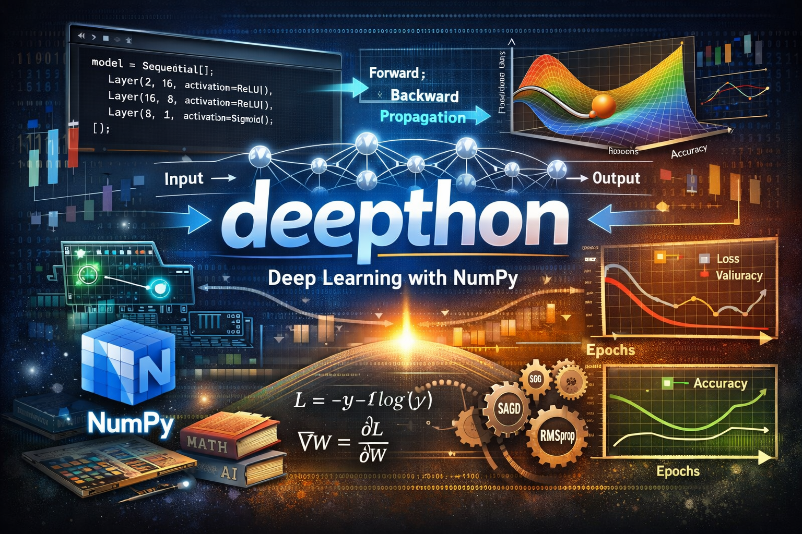

# Experiments Demo Video :

https://github.com/user-attachments/assets/a50e7604-2e9a-456f-bdb3-f56cebd75c0f

---

<div align="center">

# 🧠 **deepthon**
### *A Minimal Deep Learning Framework Built from Scratch with NumPy*

## **Research-oriented • Transparent • Mathematical • Lightweight**

[](https://numpy.org)
[](LICENSE)
[](#)
[](https://github.com/Ibraheem-Al-hafith/deepthon)



---

### **Table of Contents**
[Abstract](#-abstract) • [Motivation](#-motivation) • [Features](#-features) • [Installation](#-installation) 
[Minimal Experiment](#-minimal-experiment) • [Pipeline & Automation](#-pipeline--automation-experiments) •
[Codebase](#-codebase) • [Comparison](#-comparison) • [Roadmap](#-roadmap) 

</div>

---

# 📜 Abstract
**deepthon** is a **from-scratch neural network framework** implemented using only **NumPy**.  
It is designed to serve as a **research, educational, and experimental platform** for understanding the internal mechanics of modern deep learning systems.

Unlike PyTorch or TensorFlow, **deepthon exposes the mathematics** behind forward propagation, loss computation, and backpropagation.

---

# 🧬 Motivation
Modern deep learning frameworks hide critical details behind automatic differentiation and optimized kernels. This is excellent for production—but hides the "why" during research. **deepthon** treats neural networks not as black boxes, but as **numerical systems**.

---

# ✨ Features
| Category | Capabilities |
|--------|--------------|
| 🧠 Models | `Sequential` API, fully modular layers |
| 🔢 Math | Manual forward & backward propagation |
| ⚡ Optimization | SGD, Adam, RMSProp, LR schedulers |
| 📉 Losses | MSE, BCE, Cross-Entropy |
| 🧪 Automation | YAML-driven experiments, CLI, and UI |
| 🪶 Deps | NumPy only |

---


## 🛠️ Installation & Setup

We recommend using **uv** for fast, reproducible environment management.

### 🐧 Linux / 🍎 Mac

```bash
# Install uv
curl -LsSf https://astral.sh/uv/install.sh | sh

# Clone and setup project
git clone https://github.com/Ibraheem-Al-hafith/deepthon.git
cd deepthon
uv sync

```

### 🪟 Windows

```powershell
powershell -ExecutionPolicy ByPass -c "irm https://astral.sh/uv/install.sh | iex"
git clone https://github.com/Ibraheem-Al-hafith/deepthon_pipeline.git
cd deepthon
uv sync

```

---


---

# 🚀 Minimal Experiment

You can build and train a model programmatically using the core library:

```python
from deepthon.nn.activations import ReLU, Sigmoid
from deepthon.nn.optimizers import Adam
from deepthon.nn.losses import BCE
from deepthon.pipeline import Trainer
import numpy as np

X = np.random.randn(100, 2)
y = np.random.randint(0, 2, 100).reshape(-1, 1)
model = Sequential([
    Layer(2, 16, activation=ReLU()),
    Layer(16, 1, activation=Sigmoid())
])

trainer = Trainer(model=model, optimizer=Adam(lr=1e-3), loss_func=BCE())
trainer.train(X, y, epochs=30)

```

---

# 🏃 Pipeline & Automation (Experiments)

Beyond the library, **deepthon** includes a production-ready pipeline in the `/experiments` directory. This allows you to run reproducible experiments without writing Python code for every trial.

### 1. Config-Driven Training

Define your entire experiment—architecture, dataset, and hyperparameters—in a `config.yaml` file:


```yaml
experiment: turbines_experiment
datasets:
  mnist:
    name: mnist
    input_dim: 784
    output_dim: 10
    urls:
      train_images: [https://raw.githubusercontent.com/fgnt/mnist/master/train-images-idx3-ubyte.gz](https://raw.githubusercontent.com/fgnt/mnist/master/train-images-idx3-ubyte.gz)
      train_labels: [https://raw.githubusercontent.com/fgnt/mnist/master/train-labels-idx1-ubyte.gz](https://raw.githubusercontent.com/fgnt/mnist/master/train-labels-idx1-ubyte.gz)
    train_config:
      loss_fn: CCE
      metric: f1
  cancer:
    name: cancer
    input_dim: 30
    output_dim: 1
    train_config:
      loss_fn: BCE
      metric: f1

model:
  tiny:
    type: sequential
    architecture:
      - [null, 64, relu]
      - [batchnorm, 64]
      - [Dropout, 0.2]
      - [64, null, linear]

training:
  batch_size: 64
  epochs: 100
  optimizer:
    name: adamw
    lr: 0.001

```

---


### 2. CLI Interface

Run experiments directly from your terminal using the built-in CLI:

```bash
# Train using a config file
python -m experiments.deepthon_pipeline.cli.main train --config experiments/configs/config.yaml

# Evaluate specific checkpoints
python -m experiments.deepthon_pipeline.cli.main test --config experiments/configs/config.yaml --model tiny --dataset mnist

```

### 3. Interactive UI

Launch a **Gradio** or **Streamlit** dashboard to visualize data and test your models:

```bash
uv run python -m experiments.deepthon_pipeline.ui.app

```

---

# 🗂 Codebase

```text
.
├── assets/                    # Project-wide media (demos, global images)
├── data/                      # Data storage
│   ├── processed/             # Cleaned .npy files (MNIST, Cancer, Turbines)
│   └── raw_mnist/             # Original byte files
├── deepthon_lib/              # 🧠 THE CORE LIBRARY (Package 1)
│   ├── deepthon/              # Source code
│   │   ├── nn/                # Layers, Activations, Losses, Optimizers
│   │   ├── pipeline/          # Dataloaders and Trainer logic
│   │   └── utils/             # Metrics and Splitting tools
│   ├── examples/              # Usage scripts for the library
│   ├── docs/                  # Documentation files
│   ├── pyproject.toml         # Library-specific dependencies
│   └── README.md              # Library-specific documentation
├── experiments/               # 🏃 THE MLOPS PIPELINE (Package 2)
│   ├── deepthon_pipeline/     # Source code
│   │   ├── cli/               # Entry points for Terminal commands
│   │   ├── config/            # YAML loading logic
│   │   ├── data/              # Pipeline-specific data registry
│   │   ├── models/            # Dynamic model builders
│   │   ├── training/          # Experiment runners
│   │   └── ui/                # Gradio/Streamlit application
│   ├── configs/               # YAML experiment definitions
│   ├── pyproject.toml         # Pipeline-specific dependencies
│   └── README.md              # Pipeline-specific documentation
├── tests/                     # 🧪 Unified Test Suite
├── logs/                      # Experiment output logs
├── pyproject.toml             # ⚙️ WORKSPACE CONFIG (Root)
├── uv.lock                    # Global lockfile
└── README.md                  # Main project landing page

```

---

# 🧠 Comparison

| Feature | deepthon | PyTorch |
| --- | --- | --- |
| Transparency | ⭐⭐⭐⭐⭐ | ⭐⭐ |
| Debugging | Easy | Hard |
| Learning | Excellent | Moderate |
| Implementation | Explicit | Abstract |

---

# 🛣 Roadmap

* [ ] **CNN Support**: Adding Convolutional and Pooling layers.
* [ ] **Autograd Engine**: Moving from manual to automatic differentiation.
* [ ] **Model Serialization**: Save/Load models as JSON/HDF5.
* [ ] **CuPy Backend**: GPU acceleration for large-scale NumPy ops.

---


<div align="center">

Built with ❤️ by **Ibraheem Al-Hafith** *Where deep learning meets mathematics.*

</div>
